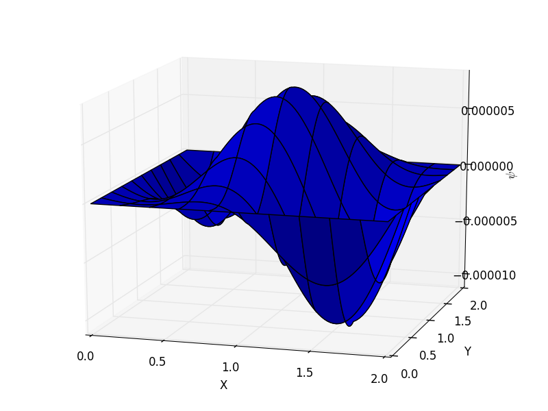
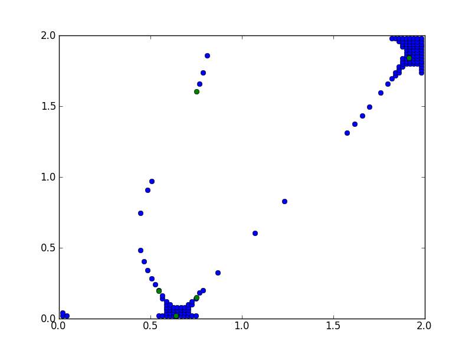

##Early results

##Papers
* review paper on fermion nodes
http://people.physics.illinois.edu/Ceperley/papers/059a.pdf
better quality,same paper http://www.springerlink.com/content/m344615283325722/fulltext.pdf

* fermion monte carlo without fixed nodes
http://jcp.aip.org/resource/1/jcpsa6/v131/i5/p054106_s1
* Structure of fermion nodes http://arxiv.org/pdf/cond-mat/0601485v1.pdf

##Investigate them
* Numerical sign problem http://en.wikipedia.org/wiki/Numerical_sign_problem
  Basically, integration of highly oscillatory functions give you headache (this sentence doesn't say anything).

##Read later
* http://prl.aps.org/abstract/PRL/v72/i15/p2442_1
* http://altair.physics.ncsu.edu/articles.htm

##Google keyword tried
https://www.google.com/search?ix=aca&sourceid=chrome&ie=UTF-8&q=fermion+node
https://www.google.com/search?aq=f&ix=aca&sourceid=chrome&ie=UTF-8&q=%22fixed-node+quantum+Monte+Carlo%22
https://www.google.com/search?ix=aca&sourceid=chrome&ie=UTF-8&q=free+fermion+node
